<div align="center">
  <h1>🚗 Park+ — Bengaluru Parking Intelligence Platform</h1>
  <p><em>An AI-powered parking enforcement decision engine built for the Gridlock Hackathon 2.0 by Bengaluru Traffic Police + Flipkart.</em></p>
</div>

---

## 🌟 Solution Overview

Park+ moves beyond descriptive dashboards. It doesn't just show you *where* violations happen; it tells you **where to deploy officers right now** to maximize congestion relief. 

By analyzing historical violation records, integrating live city events, and simulating enforcement ROI, Park+ acts as a **Dynamic Copilot** for traffic police to strategically tackle illegal parking and reduce overall gridlock.

---

## 🤖 AI Dynamic Copilot

Park+ comes with an integrated, intelligent **AI Copilot** designed to empower traffic personnel on the ground and command centers alike.
- **Query Deployments**: Instantly ask the system for optimal deployment locations based on real-time and forecasted data.
- **Natural Language Insights**: Retrieve complex Congestion Impact Index (CII) and Enforcement Priority Index (EPI) metrics using conversational queries.
- **ROI Estimation**: Ask the copilot questions like *"What happens if I deploy an officer to Silk Board Junction?"* and receive instant simulated congestion relief metrics.

---

## 🖼️ Platform Screenshots

### Interactive Dashboard

| Dashboard Overview | Dashboard Details |
| :---: | :---: |
| 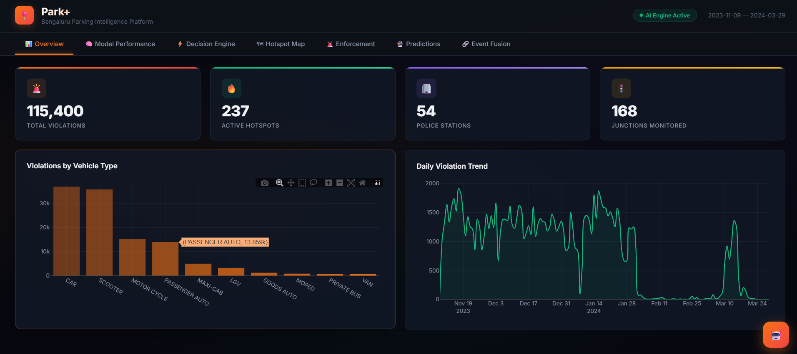 | 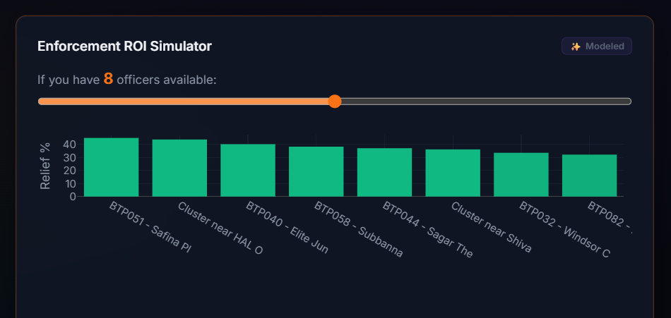 |
| 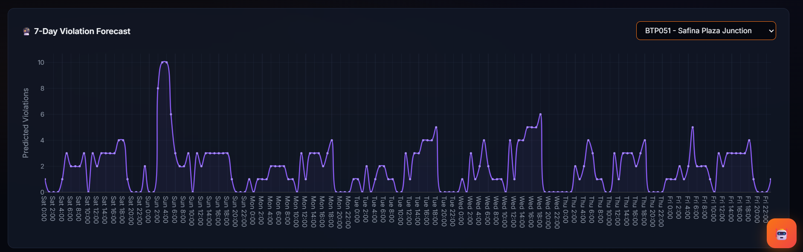 | 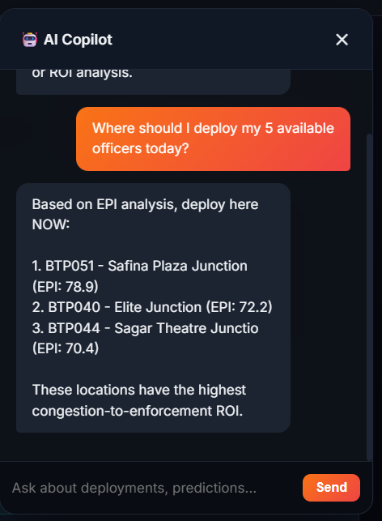 |
| 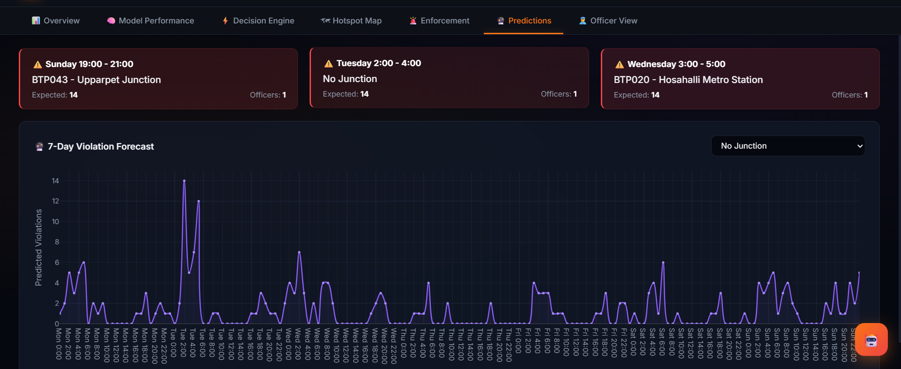 | 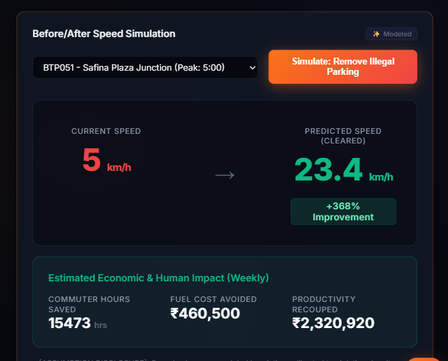 |
| 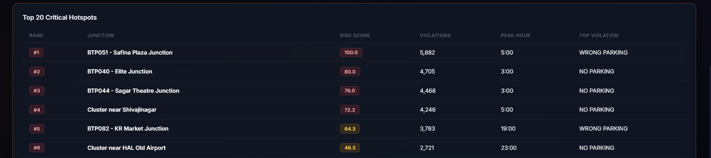 | 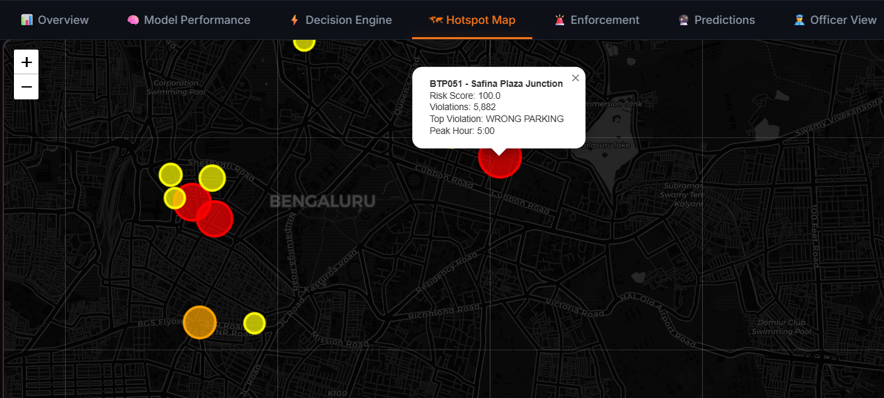 |

### Hotspot Map
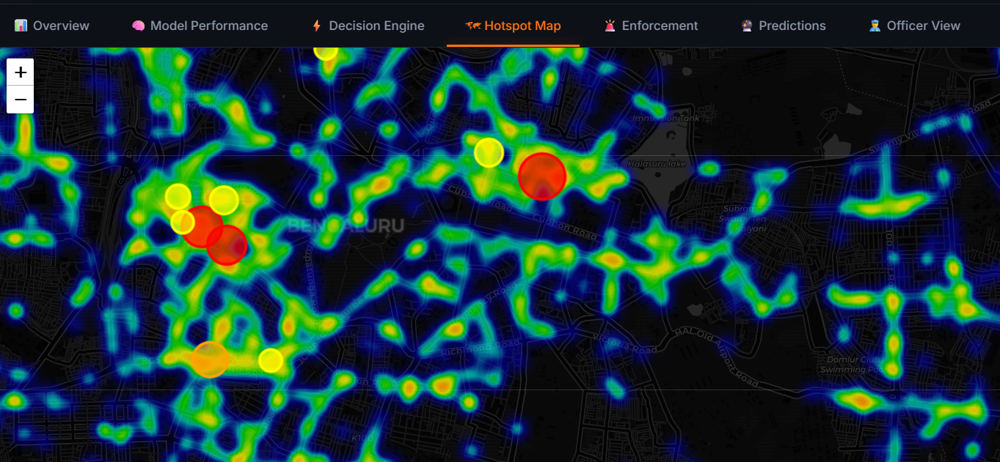

---

## 🏗️ Architecture & Tech Stack

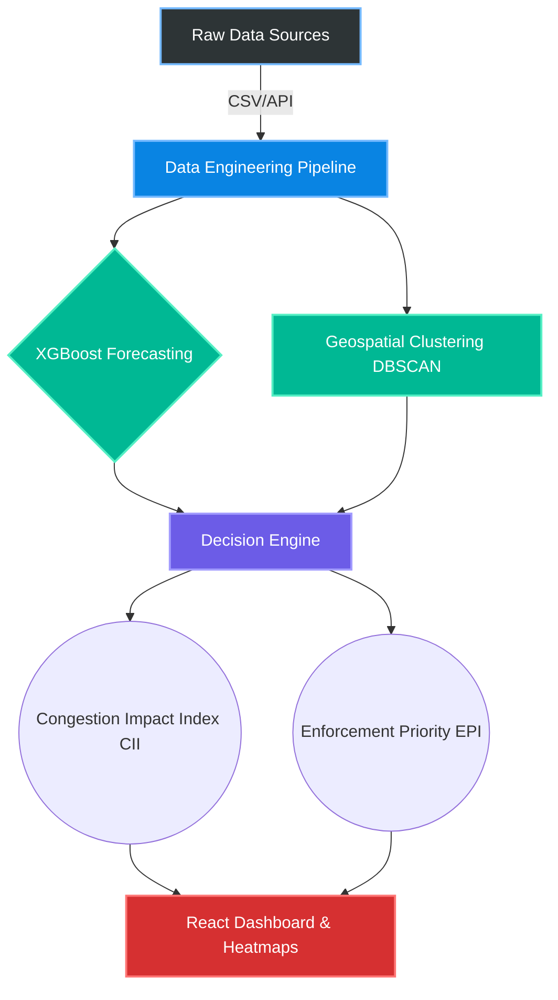

**Technologies Used:**
- **Data Engineering:** Python, Pandas, Numpy 
- **Machine Learning:** XGBoost (Forecasting with 23 features)
- **Geospatial & Mapping:** scikit-learn DBSCAN, Folium, and OpenStreetMap (OSM)
  > [!NOTE] 
  > **Mapping Infrastructure:** We utilized open-source maps (Folium/OSM) for rapid prototyping. Our architecture is highly modular; integrating **MapMyIndia** APIs for production simply requires swapping the base tile layer URL. The core backend AI and spatial clustering are 100% compatible.
- **Frontend:** React, Plotly.js, Glassmorphism UI

---

## 🔄 Project Flow

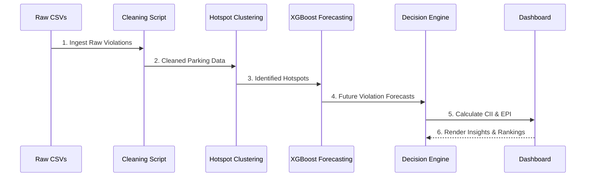

---

## 📁 Folder Structure

```text
parkpulse/
├── .gitignore               # Git ignore file
├── .vercelignore            # Vercel ignore file
├── dashboard/               # Frontend React/HTML application
│   └── index.html           # Main dashboard entry point
├── data/                    # Datasets (Place raw CSV here)
│   └── jan_to_may_police_violation_anonymized.csv
├── outputs/                 # Generated artifacts, models, & reports
│   ├── dashboard_data.json
│   ├── hotspot_map.html
│   └── model_metrics.json
├── scripts/                 # Python data processing & ML pipeline
│   ├── 01_clean_data.py
│   ├── 02_hotspot_clustering.py
│   ├── 02b_geo_enrichment.py
│   ├── 03_enforcement_priority.py
│   ├── 04_time_forecasting.py
│   ├── 05_decision_engine.py
│   ├── 06_enforcement_mode.py
│   ├── 07_generate_dashboard_data.py
│   └── requirements.txt     # Python dependencies
├── README.md                # This file
└── vercel.json              # Vercel configuration
```

---

## 📊 Sample Dataset Rows

**1. Police Violation Data (`jan_to_may_police_violation_anonymized.csv`)**
```csv
id,latitude,longitude,location,vehicle_number,vehicle_type,violation_type,created_datetime
FKID000000,12.9255567,77.618665,"18th Main Road...",FKN00GL0000,CAR,"[""WRONG PARKING""]",2023-11-20 00:28:46+00
FKID000001,12.9054633,77.7007781,"Sarjapura Main Road...",FKN00GL0001,CAR,"[""NO PARKING""]",2023-11-24 22:46:46+00
```

---

## 🧠 Methodology & Assumptions

1. **Congestion Impact Index (CII):** `(Violation Density * 0.25) + (Junction Type * 0.15) + (Peak Hour * 0.15) + (Vehicle Severity * 0.10) + (Road Capacity * 0.20) + (Choke Proximity * 0.15)`
2. **Enforcement Priority Index (EPI):** `(Violation Density * 0.50) + (CII * 0.35) + (Forecasted Violations * 0.15)`
3. **Enforcement ROI Simulation (Relief %):** Removing illegal parking has logarithmic diminishing returns.
4. **Before/After Speed Simulation:** Modeled using a standard square-root congestion heuristic calibrated to violation density.

---

## 🏆 Model Performance (XGBoost)

| Metric | Score | Note |
|--------|-------|------|
| **R² Score** | `63.1%` | Very strong fit for noisy violation data |
| **Test MAE** | `5.57` | Predictions are within ~5.5 violations of truth |
| **Test RMSE**| `10.54` | Penalizes large outlier predictions |
| **Features** | `23` | Lag features, cyclical time encodings, interactions |

---

## 🚀 Commands to Run

**1. Install Dependencies**
```bash
pip install -r scripts/requirements.txt
```

**2. Ensure Data Exists**
Since the anonymized dataset is larger than GitHub's file limit, please download the CSV files from our [Google Drive Dataset Link](https://drive.google.com/drive/folders/1Khnd5x7Yi2SzmpglolqQRBcrkYXrMHqJ?usp=sharing) and place them inside the `data/` directory.

**3. Run the Full ML & Processing Pipeline**
Execute the scripts in sequential order to generate all the outputs and metrics:
```bash
python scripts/01_clean_data.py
python scripts/02_hotspot_clustering.py
python scripts/02b_geo_enrichment.py
python scripts/03_enforcement_priority.py
python scripts/04_time_forecasting.py
python scripts/05_decision_engine.py
python scripts/06_enforcement_mode.py
python scripts/07_generate_dashboard_data.py
```

**4. View Dashboard**
Open `dashboard/index.html` in your web browser. No backend server is required!

---
<div align="center">
  <p>Built with ❤️ for Bengaluru Traffic Police & Flipkart Gridlock Hackathon</p>
</div>
