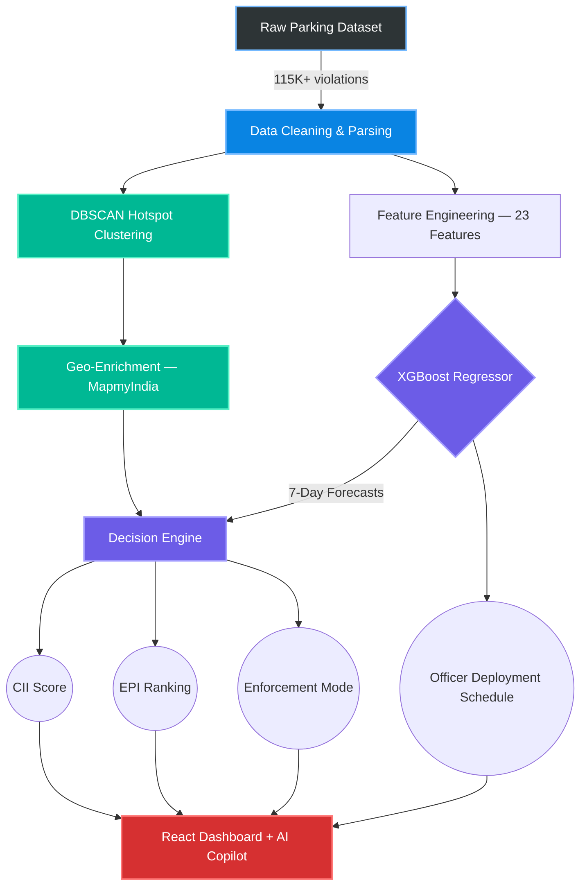
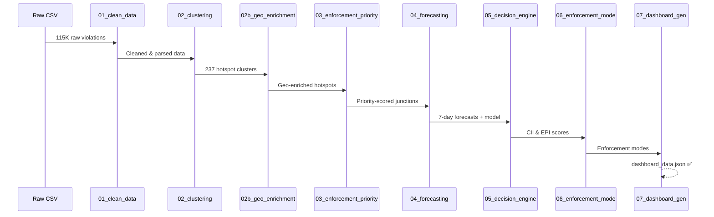

<div align="center">

# 🚗 Park+ — Bengaluru Parking Intelligence Platform

### *An AI-powered enforcement decision engine built for Gridlock Hackathon 2.0*
### *Bengaluru Traffic Police × Flipkart*

<br>

[](https://python.org)
[](https://xgboost.readthedocs.io)
[](https://reactjs.org)
[](https://plotly.com)

<br>

> **Park+ doesn't just show you *where* violations happen — it tells you *where to deploy officers right now* to maximize congestion relief.**

</div>

---

## 💡 The Problem

Bengaluru Traffic Police (BTP) currently treats all parking violations equally — a wide 4-lane road with 500 violations is weighted the same as a narrow 2-lane chokepoint with just 50. Out of **115,400+ recorded violations**, exactly **zero** have a recorded follow-up enforcement action. Park+ closes this gap with data-driven, predictive deployment intelligence.

---

## 🌟 Solution Overview

Park+ is a **predictive enforcement decision engine** that analyzes historical violation records, infers road-capacity loss through geospatial intelligence, and forecasts future violation spikes — acting as a **Dynamic Copilot** for traffic police.

Our headline metric: the **Enforcement Efficiency Gain** — representing the modeled average traffic speed improvement across critical chokepoints when targeted illegal parking is cleared.

### Key Capabilities

| Capability | Description |
|:---|:---|
| 🧠 **Congestion Impact Index (CII)** | 6-factor weighted score combining density, junction type, peak hours, severity, road capacity & choke proximity |
| 📊 **Enforcement Priority Index (EPI)** | Ranks all 237 hotspots by deployment urgency using CII + violation density + XGBoost forecasts |
| 🎯 **Enforcement Mode Classifier** | AI recommends Fixed ANPR Camera, Mobile Patrol, or Monitor Only for each hotspot |
| 🔮 **7-Day Violation Forecasting** | XGBoost regressor trained on 23 features predicts where violations will spike next |
| 🤖 **AI Copilot** | Natural language assistant for instant deployment queries, ROI estimation & metric lookups |
| 👮 **Officer View** | Mobile-friendly deployment schedule showing exactly where and when officers are needed |

---

## 🖼️ Platform Screenshots

### Dashboard Overview
<p align="center">
  
  
</p>

### Decision Engine & Analytics
<p align="center">
  
  
</p>

### Enforcement & Predictions
<p align="center">
  
  
</p>

### AI Copilot & Model Performance
<p align="center">
  
  
</p>

### Hotspot Heatmap
<p align="center">
  
</p>

---

## 🤖 AI Dynamic Copilot

Park+ includes an intelligent **AI Copilot** embedded directly into the dashboard:

- 🗣️ **"Where should I deploy my 5 available officers?"** — Instant EPI-ranked deployment recommendations
- 📈 **"What's the ROI of deploying to Silk Board Junction?"** — Simulated congestion relief metrics
- 🔍 **"Show me model accuracy"** — Real-time R², MAE, and baseline comparison stats
- 🚨 **"Which stations need enforcement?"** — Priority-ranked station analysis

> The copilot is grounded in your actual EPI rankings, forecasts, and ROI simulations — not a generic chatbot.

---

## 🏗️ Architecture



---

## 🔄 Data Pipeline

The pipeline runs as **7 sequential Python scripts**, each producing CSV/JSON artifacts consumed by the next:



---

## 🧠 Methodology

### Congestion Impact Index (CII)

A composite score (0–100) measuring the *true congestion impact* of illegal parking at each hotspot:

| Factor | Weight | Description |
|:---|:---:|:---|
| Violation Density | 25% | Normalized count of violations per cluster |
| Junction Type Multiplier | 15% | Intersections penalized 1.8× vs mid-block |
| Peak Hour Concentration | 15% | % of violations during rush hours (8–10 AM, 5–8 PM) |
| Vehicle Severity | 10% | Heavy vehicles (buses, trucks) weighted higher |
| Road Capacity | 20% | Arterial roads lose less capacity than local streets |
| Choke Proximity | 15% | Distance to nearest congestion-inducing POI |

### Enforcement Priority Index (EPI)

Ranks hotspots by deployment urgency:

| Factor | Weight |
|:---|:---:|
| Violation Density | 50% |
| CII (Congestion Impact) | 35% |
| Forecasted Violations (7-day) | 15% |

### Enforcement Mode Classifier

| Mode | Criteria |
|:---|:---|
| 🎥 **Fixed ANPR Camera** | High chronicity (violations every day) + tight time window |
| 🚔 **Mobile Patrol** | High impact but variable timing |
| 👁️ **Monitor Only** | Low-impact areas below threshold |

---

## 🏆 Model Performance

| Metric | Score | Interpretation |
|:---|:---:|:---|
| **R² Score** | `63.1%` | Strong fit for inherently noisy violation data |
| **Test MAE** | `5.57` | Predictions within ~5.5 violations of ground truth |
| **Test RMSE** | `10.54` | Penalizes large outlier predictions appropriately |
| **Features Used** | `23` | Lag features, cyclical time encodings, interaction terms |

---

## 📁 Project Structure

```
parkplus/
├── dashboard/
│   └── index.html               # React dashboard (single-file, no build step)
├── data/
│   └── jan_to_may_police_violation_anonymized.csv
├── images/                       # Dashboard screenshots for README
├── outputs/                      # Generated artifacts (CSVs, JSONs, model)
│   ├── dashboard_data.json       # Final dashboard payload
│   ├── hotspot_map.html          # Interactive Folium heatmap
│   ├── xgboost_model.pkl         # Serialized trained model
│   └── ...                       # Intermediate pipeline CSVs
├── scripts/
│   ├── 01_clean_data.py          # Parse, clean, standardize
│   ├── 02_hotspot_clustering.py  # DBSCAN spatial clustering
│   ├── 02b_geo_enrichment.py     # Road class & choke proximity
│   ├── 03_enforcement_priority.py # Station-level priority scoring
│   ├── 04_time_forecasting.py    # XGBoost training & 7-day prediction
│   ├── 05_decision_engine.py     # CII + EPI calculation
│   ├── 06_enforcement_mode.py    # Fixed vs Mobile classifier
│   ├── 07_generate_dashboard_data.py  # Final JSON/JS export
│   └── requirements.txt         # Python dependencies
├── vercel.json                   # Static deployment config
└── README.md
```

---

## 🚀 Getting Started

### 1. Clone & Install

```bash
git clone https://github.com/sanyam-15/Parkplus.git
cd Parkplus
pip install -r scripts/requirements.txt
```

### 2. Add Dataset

Place `jan_to_may_police_violation_anonymized.csv` inside the `data/` directory.

> 📦 The dataset exceeds GitHub's file limit. Download from our [Google Drive](https://drive.google.com/drive/folders/1Khnd5x7Yi2SzmpglolqQRBcrkYXrMHqJ?usp=sharing).

### 3. Run the Pipeline

```powershell
# On Windows PowerShell (required for Unicode output)
$env:PYTHONIOENCODING="utf-8"

python scripts/01_clean_data.py
python scripts/02_hotspot_clustering.py
python scripts/02b_geo_enrichment.py
python scripts/03_enforcement_priority.py
python scripts/04_time_forecasting.py
python scripts/05_decision_engine.py
python scripts/06_enforcement_mode.py
python scripts/07_generate_dashboard_data.py
```

### 4. View Dashboard

Open `dashboard/index.html` in your browser. **No backend server required!**

> 🌐 Also deployed on Vercel for instant access.

---

## ⚙️ Geo-Enrichment: MapmyIndia Integration

The `02b_geo_enrichment.py` script is designed to integrate with **MapmyIndia APIs** for real-time road classification and POI proximity data.

```bash
# To enable live API calls:
$env:MAPMYINDIA_API_KEY="your_api_key_here"
python scripts/02b_geo_enrichment.py
```

> [!NOTE]
> **Mock Mode:** When no API key is set, the script automatically generates deterministic simulated geo-data using seeded random values. All mock data is labeled in console output. The architecture is fully plug-and-play for production API integration.

---

<div align="center">

### Built with ❤️ for Bengaluru Traffic Police & Flipkart Gridlock Hackathon 2.0

<br>

*Park+ — Because every officer deployed at the right place, at the right time, is a chokepoint prevented.*

</div>
