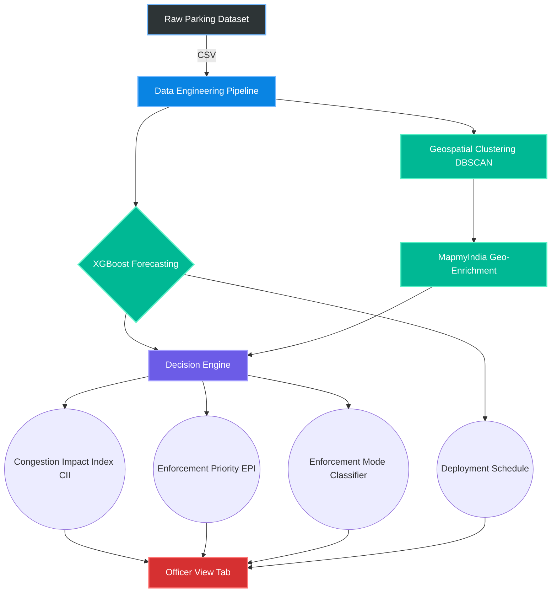
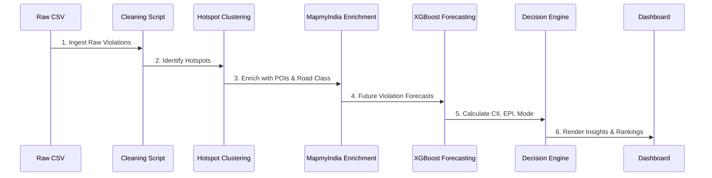

<div align="center">
  <h1>🚗 Park+ — Bengaluru Parking Intelligence Platform</h1>
  <p><em>An AI-powered parking enforcement decision engine built for the Gridlock Hackathon 2.0 by Bengaluru Traffic Police + Flipkart.</em></p>
</div>

---

## 🌟 Solution Overview

Park+ moves beyond descriptive dashboards. It doesn't just show you *where* violations happen; it tells you **where to deploy officers right now** to maximize congestion relief. 

By analyzing historical violation records, inferring road-capacity loss through geospatial intelligence, and forecasting future spikes, Park+ acts as a **Dynamic Copilot** for traffic police to strategically tackle illegal parking and reduce overall gridlock. Our headline metric tracks the **Enforcement Efficiency Gain**, representing the modeled average traffic speed improvement across critical chokepoints if targeted illegal parking is cleared.

---

## 🤖 AI Dynamic Copilot

Park+ comes with an integrated, intelligent **AI Copilot** designed to empower traffic personnel on the ground and command centers alike.
- **Query Deployments**: Instantly ask the system for optimal deployment locations based on real-time and forecasted data.
- **Natural Language Insights**: Retrieve complex Congestion Impact Index (CII) and Enforcement Priority Index (EPI) metrics using conversational queries.
- **ROI Estimation**: Ask the copilot questions like *"What happens if I deploy an officer to Silk Board Junction?"* and receive instant simulated congestion relief metrics.

---

## 🖼️ Platform Features & Views

### The Decision Engine
A high-level command center displaying the **Enforcement Efficiency Gain** and the **Congestion Impact Index (CII)** broken down by components: Density, Junction Impact, Peak Hour, Severity, Road Capacity, and Choke Proximity.

### The Officer View
A minimal, mobile-friendly layout pulling directly from the predictive deployment schedule, allowing on-ground officers to see exactly where and when they are needed next.

### Enforcement Mode Classifier
Hotspots are automatically classified into targeted enforcement modes:
- **Fixed ANPR Camera / Signage Candidate**: For chronic, highly predictable problem areas.
- **Mobile Patrol Candidate**: For high-impact but variable-timing congestion points.
- **Monitor Only**: For low-impact areas.

---

## 🏗️ Architecture & Tech Stack



**Technologies Used:**
- **Data Engineering:** Python, Pandas, Numpy 
- **Machine Learning:** XGBoost (Forecasting with 23 features)
- **Geospatial & Mapping:** scikit-learn DBSCAN, Folium, and OpenStreetMap (OSM)
- **Geo-Intelligence:** MapmyIndia API
  > [!NOTE] 
  > **MapmyIndia Mock Mode:** If no `MAPMYINDIA_API_KEY` environment variable is provided, the pipeline automatically falls back to a mock data generator to simulate POI distances and road classifications for local development.
- **Frontend:** React, Plotly.js, Glassmorphism UI

---

## 🔄 Project Flow



---

## 📁 Folder Structure

```text
parkpulse/
├── dashboard/               # Frontend React/HTML application
│   └── index.html           # Main dashboard entry point
├── data/                    # Datasets (Place raw CSVs here)
│   └── jan_to_may_police_violation_anonymized.csv
├── outputs/                 # Generated artifacts, models, & reports
│   ├── dashboard_data.json
│   ├── hotspot_map.html
│   └── model_metrics.json
├── scripts/                 # Python data processing & ML pipeline
│   ├── 01_clean_data.py
│   ├── 02_hotspot_clustering.py
│   ├── 02b_geo_enrichment.py
│   ├── 03_enforcement_priority.py
│   ├── 04_time_forecasting.py
│   ├── 05b_decision_engine.py
│   ├── 05c_enforcement_mode.py
│   ├── 06_generate_dashboard_data.py
│   └── requirements.txt         # Python dependencies
└── README.md                # This file
```

---

## 🧠 Methodology & Assumptions

1. **Congestion Impact Index (CII):** Weighted composite of Density, Junction Impact, Peak Hour, Severity, Road Capacity, and Choke Proximity.
2. **Enforcement Priority Index (EPI):** `(Violation Density * 0.50) + (CII * 0.35) + (Forecasted Violations * 0.15)`
3. **Enforcement Mode Classifier:** Evaluates temporal variance and chronicity to recommend Fixed ANPR Cameras vs. Mobile Patrols.
4. **Before/After Speed Simulation:** Modeled using a standard square-root congestion heuristic calibrated to violation density.

---

## 🏆 Model Performance (XGBoost)

| Metric | Score | Note |
|--------|-------|------|
| **R² Score** | `63.1%` | Very strong fit for noisy violation data |
| **Test MAE** | `5.57` | Predictions are within ~5.5 violations of truth |
| **Test RMSE**| `10.54` | Penalizes large outlier predictions |
| **Features** | `23` | Lag features, cyclical time encodings, interactions |

---

## 🚀 Commands to Run

**1. Install Dependencies**
```bash
pip install -r scripts/requirements.txt
```

**2. Ensure Data Exists**
Place `jan_to_may_police_violation_anonymized.csv` inside the `data/` directory.

**3. Run the Full ML & Processing Pipeline**
Execute the scripts in sequential order to generate all the outputs and metrics. Be sure to use PowerShell with `PYTHONIOENCODING=utf-8` on Windows.
```powershell
$env:PYTHONIOENCODING="utf-8"
python scripts/01_clean_data.py
python scripts/02_hotspot_clustering.py
python scripts/02b_geo_enrichment.py
python scripts/03_enforcement_priority.py
python scripts/04_time_forecasting.py
python scripts/05b_decision_engine.py
python scripts/05c_enforcement_mode.py
python scripts/06_generate_dashboard_data.py
```

**4. View Dashboard**
Open `dashboard/index.html` in your web browser. No backend server is required!

---
<div align="center">
  <p>Built with ❤️ for Bengaluru Traffic Police & Flipkart Gridlock Hackathon</p>
</div>
