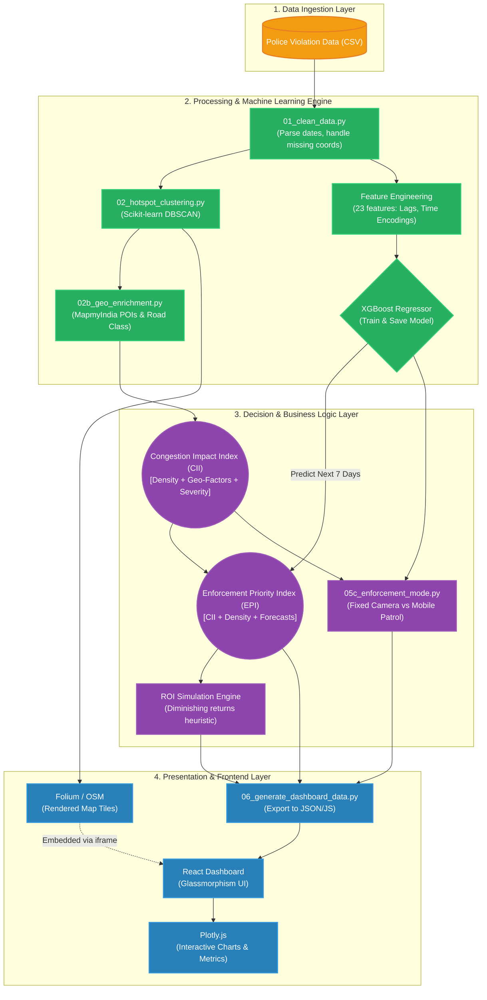

# Park+ Detailed Architecture Diagram

This file contains the detailed Mermaid.js architecture diagram for the Park+ project. You can copy the code block below and paste it into any Mermaid-compatible viewer (like GitHub, Notion, or Mermaid Live Editor).

